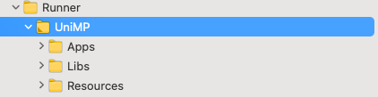

# flutter_uniapp


**flutter 集成uni_app! unisdk:V3.1.22 **

可以给个star🐴，混口饭吃

邮箱：yldebug@gmail.com

*注意*：此插件仍处于开发阶段，某些API可能尚未推出 目前只集成了基础包!。

*注意*：目前还不确定与哪些库会造成冲突，谨慎使用哦!。


### 安装依赖：
```yaml
dependencies:
  flutter:
    sdk: flutter
  # 添加依赖
  flutter_uniapp: 
    git:
      url: git://github.com/yldebug/flutter_uniapp.git
      ref: dev

```


### 配置

##### Android:
在 `/android/app/build.gradle` 中添加下列代码：

```groovy
def mfph = [
      //包名
      "apk.applicationId" : "替换成自己应用 ID",
]
android: {
  defaultConfig {
    minSdkVersion 21
    multiDexEnabled true
    manifestPlaceholders = mfph
    ndk {
        //选择要添加的对应 cpu 类型的 .so 库。
        abiFilters 'x86','armeabi-v7a',"arm64-v8a" //不支持armeabi
    }
  }
  aaptOptions {
      additionalParameters '--auto-add-overlay'
      ignoreAssetsPattern "!.svn:!.git:.*:!CVS:!thumbs.db:!picasa.ini:!*.scc:*~"
  }  
}
```
在`res/values` 新建文件strings.xml：
```xml
<resources>
    <string name="app_name">UnimpDemo</string>
</resources>
```
##### Ios (dev 版本还没有做):
* IOS 导入官方SDK Core/Libs&& Core/Resources 以及Apps 放wgt包 *


[SDK参考](https://nativesupport.dcloud.net.cn/UniMPDocs/SDKDownload/ios)


### 方法说明
* 头文件引入
```
import 'package:flutter_uniapp/flutter_uniapp.dart';
```
* 初始化

```
 /**
   * 初始化
   * fontSize,
   * fontColor,
   * fontWeight,
   * enableBackground: true表示小程序退出时进入后台 false表示直接退出
   * capsule: true使用胶囊按钮 false不使用
   * callback: 初始化回调
   * menuButtonClickCallBack: 设置menu点击事件回调接口
   * mPOnCloseCallBack: 小程序被关闭事件监听
   * uniMPEventCallBack: 监听小程序发送给宿主的事件
   */
   await FlutterUniapp.init();
```

* 唤起UniApp
```
 /**
   * appId:目标 appId
   * redirectPath:目标路径
   * wgtPath: wgt路径
   * arguments: 参数
   * isSplash: 是否开启启动页
   * return: //true 为启动成功，其他为失败
   */
 await FlutterUniapp.startApp(
      appId: '__UNI__04E3A11',
      redirectPath: '',
  );
```

* 释放wgt包
```
 /**
   * appId:目标 appId
   * wgtPath:目标路径
   * isStartApp: 释放成功后是否启动
   * callback: 回调
   * return: //true 为启动成功，其他为失败
   */
 await FlutterUniapp.wgtToRunPath(
      appId: '__UNI__04E3A11',
      wgtPath: '',
      isStartApp: '',
      callback: (bool res){},
  );
```


* 获取小程序版本
```
 /**
   * appId:目标 appId
   * return: {name:'',code:''}
   */
 await FlutterUniapp.getAppVersionInfo(
      appId: '__UNI__04E3A11'
  );
```


* 检测小程序是否存在
```
 /**
   * appId:目标 appId
   * return: true 为存在，其他为失败
   */
 await FlutterUniapp.isExistsApp(
      appId: '__UNI__04E3A11'
  );
```

* 关闭当前小程序
```
 /**
   * appId:目标 appId
   */
 await FlutterUniapp.closeCurrentApp();
```

* 获取当前运行小程序appId
```
 /**
   * return: String
   */
 await FlutterUniapp.getRuningAppid;
```

* 获取小程序运行目录
```
 /**
   * return: String
   */
 await FlutterUniapp.getAppBasePath;
```


* 检测是否初始化引擎
```
 /**
   * return:  true 为初始化，其他为失败或未初始化
   */
 await FlutterUniapp.isInitialize;
```
